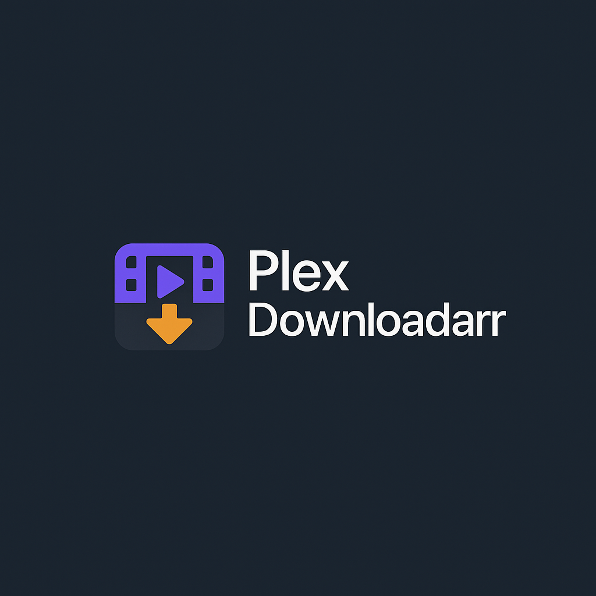

# PlexDownloadarr

<p align="center">
  
</p>

> Your Plex library, ready to download


## Overview

PlexDownloadarr is a modern, self-hosted web application that provides a beautiful interface for downloading media from your Plex Media Server. Built with a sleek dark theme reminiscent of the *arr ecosystem (Sonarr, Radarr, Overseerr), it offers a user-friendly way to browse your Plex libraries and download original media files with a single click.

**Key Features:**
- 🎬 **Plex OAuth Integration** - Users sign in with their existing Plex accounts
- 🔒 **Secure & Permission-Aware** - Respects Plex's user access controls and library restrictions
- 📱 **Progressive Web App** - Installable on mobile devices with a native-like experience
- 🎨 **Modern Interface** - Beautiful, responsive design that works on all devices
- 🔍 **Smart Search** - Search across all accessible libraries with relevance-based results
- 📊 **Admin Dashboard** - Download history, logs, and settings management
- 🚀 **Easy Setup** - Initial setup wizard with guided configuration

---

## Why You Need PlexDownloadarr

### Common Use Cases

**For Plex Server Owners:**
- **Traveling Users**: Give your users an easy way to download media for offline viewing on flights, road trips, or areas with poor connectivity
- **Backup & Migration**: Provide a simple interface for users to retrieve their content when migrating devices
- **Media Sharing**: Allow authorized users to download content you've shared with them from your server
- **Family & Friends**: Make it easy for less technical users to grab media without needing SSH, FTP, or direct file system access

**For End Users:**
- **Offline Viewing**: Download movies and shows to watch without an internet connection
- **Device Transfers**: Move media to devices that don't have Plex apps (e.g., car entertainment systems, older tablets)
- **Data Management**: Download media to free up Plex server storage while keeping personal backups
- **No Plex Sync Required**: Direct downloads without needing Plex Pass or configuring Plex Sync

### Why Not Just Use Plex?

While Plex is excellent for streaming, it has limitations for downloading:
- **Plex Sync** requires Plex Pass (paid subscription)
- **Mobile Downloads** only work within the Plex app and can't be easily transferred
- **No Bulk Downloads** - downloading multiple items is cumbersome
- **Complex for Non-Technical Users** - accessing media files directly requires server access

PlexDownloadarr solves these problems with a simple, web-based interface that works everywhere.

---

## Installation Methods

### Prerequisites

Before installing, ensure you have:
- ✅ **Docker** installed on your system ([Get Docker](https://docs.docker.com/get-docker/))
- ✅ **Plex Media Server** running and accessible
- ✅ **Plex Account** with access to your server

### Method 1: Docker Compose (Recommended)

This is the easiest method for most users. Create a `docker-compose.yml` file:

```yaml
version: '3.8'

services:
  plexdownloadarr:
    image: ghcr.io/kikootwo/plexdownloadarr:latest
    container_name: plexdownloadarr
    restart: unless-stopped
    ports:
      - "5069:5069"
    environment:
      - PORT=5069
      - LOG_LEVEL=info
      - DATABASE_PATH=/app/data/plexdownloadarr.db
      - TZ=America/New_York  # Change to your timezone
    volumes:
      - ./data:/app/data      # Database and application data
      - ./logs:/app/logs      # Application logs
    networks:
      - plexdownloadarr

networks:
  plexdownloadarr:
    driver: bridge
```

**Start the application:**

```bash
docker-compose up -d
```

**Access the application at:** `http://localhost:5069`

### Method 2: Docker Run

If you prefer using `docker run` directly:

```bash
docker run -d \
  --name plexdownloadarr \
  --restart unless-stopped \
  -p 5069:5069 \
  -e PORT=5069 \
  -e LOG_LEVEL=info \
  -e DATABASE_PATH=/app/data/plexdownloadarr.db \
  -e TZ=America/New_York \
  -v $(pwd)/data:/app/data \
  -v $(pwd)/logs:/app/logs \
  ghcr.io/kikootwo/plexdownloadarr:latest
```

### Method 3: Build from Source

If you want to build the image yourself:

```bash
# Clone the repository
git clone https://github.com/kikootwo/PlexDownloadarr.git
cd PlexDownloadarr

# Build and start with Docker Compose
docker-compose up -d --build
```

### Configuration Options

Customize your deployment with environment variables:

| Variable | Description | Default | Example |
|----------|-------------|---------|---------|
| `PORT` | Application port | `5069` | `3000` |
| `LOG_LEVEL` | Logging verbosity | `info` | `debug`, `warn`, `error` |
| `DATABASE_PATH` | SQLite database location | `/app/data/plexdownloadarr.db` | `/data/db.sqlite` |
| `TZ` | Timezone for logs and dates | `America/New_York` | `Europe/London`, `Asia/Tokyo` |

### Initial Setup

1. **Navigate to your PlexDownloadarr instance** (e.g., `http://localhost:5069`)

2. **Create Admin Account** (First-time only):
   - Choose a username and secure password
   - This account has full administrative access

3. **Configure Plex Connection** (Settings page):
   - **Plex Server URL**: Your Plex server address (e.g., `http://192.168.1.100:32400`)
   - **Plex Token**: Your Plex authentication token ([How to find your token](https://support.plex.tv/articles/204059436-finding-an-authentication-token-x-plex-token/))
   - Click **Test Connection** to verify
   - Server details (Machine ID and Name) are fetched automatically

4. **Start Using**:
   - Admin can log in with username/password
   - Users sign in with their Plex accounts via OAuth

### Reverse Proxy Setup (Production)

For production deployments, use a reverse proxy with HTTPS:

#### Nginx Example

```nginx
server {
    listen 443 ssl http2;
    server_name downloads.yourdomain.com;

    ssl_certificate /path/to/cert.pem;
    ssl_certificate_key /path/to/key.pem;

    location / {
        proxy_pass http://localhost:5069;
        proxy_set_header Host $host;
        proxy_set_header X-Real-IP $remote_addr;
        proxy_set_header X-Forwarded-For $proxy_add_x_forwarded_for;
        proxy_set_header X-Forwarded-Proto $scheme;
    }
}
```

#### Traefik Example (docker-compose.yml)

```yaml
services:
  plexdownloadarr:
    image: ghcr.io/kikootwo/plexdownloadarr:latest
    labels:
      - "traefik.enable=true"
      - "traefik.http.routers.plexdownloadarr.rule=Host(`downloads.yourdomain.com`)"
      - "traefik.http.routers.plexdownloadarr.entrypoints=websecure"
      - "traefik.http.routers.plexdownloadarr.tls.certresolver=letsencrypt"
      - "traefik.http.services.plexdownloadarr.loadbalancer.server.port=5069"
```

---

## How It Works

### Authentication Flow

PlexDownloadarr uses a dual authentication system:

1. **Admin Authentication**:
   - One-time setup creates a local admin account
   - Admin can configure Plex connection settings
   - Access to admin features (settings, logs, all download history)

2. **Plex OAuth Authentication** (Recommended for users):
   - Users click "Sign in with Plex"
   - Redirected to Plex.tv for authorization
   - PlexDownloadarr verifies user has access to your configured Plex server
   - User's Plex permissions are automatically enforced

### Security Model

**Server Lock**: PlexDownloadarr stores your Plex server's Machine ID during setup. When users authenticate:
- The app verifies they have access to YOUR specific Plex server
- Users without access to your server are denied
- This prevents random Plex users from accessing your server through your PlexDownloadarr instance

**Permission Inheritance**: All Plex permissions are respected:
- Users only see libraries they have access to
- Downloads use the user's own Plex token
- Shared library restrictions apply

### Download Process

1. **User browses libraries** available to their Plex account
2. **Search or browse** for desired media
3. **Click download** on a movie, episode, or track
4. **File streams through PlexDownloadarr** to the user's browser
5. **Download recorded** in history (visible to admins)

### Data Storage

- **Database**: SQLite database stores users, sessions, settings, and download history
- **Logs**: Application logs written to `logs/` directory
- **No Media Storage**: PlexDownloadarr doesn't store media files—it streams them directly from your Plex server

### System Requirements

**Minimal:**
- CPU: 1 core
- RAM: 512 MB
- Storage: 100 MB (plus space for logs and database)
- Network: Access to Plex server

**Recommended:**
- CPU: 2+ cores (for concurrent downloads)
- RAM: 1 GB
- Storage: 1 GB
- Network: Good bandwidth between PlexDownloadarr and Plex server

---

## How to Contribute

We welcome contributions from the community! Here's how you can help:

### Reporting Issues

Found a bug or have a feature request?

1. **Check existing issues** to avoid duplicates
2. **Open a new issue** with:
   - Clear description of the problem/feature
   - Steps to reproduce (for bugs)
   - Expected vs actual behavior
   - Environment details (Docker version, browser, etc.)

### Contributing Code

1. **Fork the repository**
   ```bash
   git fork https://github.com/kikootwo/PlexDownloadarr.git
   ```

2. **Create a feature branch**
   ```bash
   git checkout -b feature/your-feature-name
   ```

3. **Make your changes**
   - Follow existing code style
   - Add comments for complex logic
   - Update documentation as needed

4. **Test your changes**
   ```bash
   # Backend tests
   cd backend
   npm test

   # Frontend tests
   cd frontend
   npm test

   # Build test
   docker-compose build
   ```

5. **Commit with clear messages**
   ```bash
   git commit -m "Add feature: descriptive message"
   ```

6. **Push and create Pull Request**
   ```bash
   git push origin feature/your-feature-name
   ```

### Development Setup

For local development:

```bash
# Clone repository
git clone https://github.com/kikootwo/PlexDownloadarr.git
cd PlexDownloadarr

# Backend (runs on port 5069)
cd backend
npm install
npm run dev

# Frontend (runs on port 5173)
cd frontend
npm install
npm run dev
```

See [CLAUDE.md](./CLAUDE.md) for detailed developer documentation.

### Areas We Need Help

- 🎨 **UI/UX improvements** - Design enhancements, mobile optimization
- 🐛 **Bug fixes** - Check the Issues tab
- 📚 **Documentation** - Tutorials, guides, translations
- ✨ **Features** - See our [Roadmap](#roadmap) below
- 🧪 **Testing** - Test coverage, edge cases, cross-platform testing

### Code of Conduct

- Be respectful and inclusive
- Provide constructive feedback
- Focus on the issue, not the person
- Follow project coding standards

---

## Troubleshooting

### Cannot connect to Plex server

**Symptoms**: "Failed to connect" errors in settings or when browsing

**Solutions**:
1. Verify Plex server URL is correct and accessible from the PlexDownloadarr container
2. Check Plex token is valid ([Generate new token](https://support.plex.tv/articles/204059436-finding-an-authentication-token-x-plex-token/))
3. Use the **Test Connection** button in Settings
4. Check firewall rules between PlexDownloadarr and Plex server
5. For Docker: Ensure network connectivity (`docker network inspect`)

### Plex OAuth login fails

**Symptoms**: "Access denied" or "No access to server" errors

**Solutions**:
1. Ensure Plex server Machine ID is correctly configured in Settings
2. Verify user has been granted access to your Plex server
3. Check that user's Plex account is active and not suspended
4. Try logging in directly to Plex web interface to verify account status

### Downloads not starting

**Symptoms**: Download button doesn't work or fails immediately

**Solutions**:
1. Check browser console for JavaScript errors (F12 → Console tab)
2. Verify user has proper Plex library permissions
3. Check file exists and is accessible in Plex
4. Review logs: `docker logs plexdownloadarr`
5. Ensure browser allows popups and downloads

### Port already in use

**Symptoms**: Container fails to start with port binding error

**Solutions**:
1. Change port mapping in docker-compose.yml: `"8080:5069"` (use 8080 or another free port)
2. Find process using port: `lsof -i :5069` or `netstat -tulpn | grep 5069`
3. Stop conflicting service or choose different port

### Container won't start

**Symptoms**: Container exits immediately or won't start

**Solutions**:
1. Check logs: `docker logs plexdownloadarr`
2. Verify volume paths exist and have correct permissions
3. Ensure Docker has enough resources (RAM, CPU)
4. Try pulling latest image: `docker-compose pull`
5. Clean rebuild: `docker-compose down && docker-compose up -d --build`

---

## Roadmap

### Current Features ✅
- Plex OAuth authentication
- Library browsing with posters and metadata
- Search across all libraries
- One-click downloads
- Admin settings and configuration
- Download history tracking
- System logs viewer
- Mobile-responsive design
- Progressive Web App support

### Planned Features 🚧

**Short-term:**
- [ ] Batch downloads (download multiple items as ZIP)
- [ ] Quality selection (when multiple versions exist)
- [ ] Download queue with progress tracking
- [ ] Collections support
- [ ] Advanced filters (genre, year, rating, resolution)

**Mid-term:**
- [ ] User management dashboard for admins
- [ ] Email notifications for downloads
- [ ] Download scheduling
- [ ] API rate limiting per user
- [ ] Multi-language support

**Long-term:**
- [ ] Mobile app (React Native)
- [ ] Integration with external storage (S3, OneDrive, etc.)
- [ ] Transcoding options before download
- [ ] Plugin system for extensibility

Want to help implement any of these? Check out [How to Contribute](#how-to-contribute)!

---

## Security Considerations

**Production Deployment Checklist:**
- ✅ Use HTTPS via reverse proxy (nginx, Traefik, Caddy)
- ✅ Set strong admin password during initial setup
- ✅ Configure proper Plex server URL (not public if on local network)
- ✅ Keep Plex token secure (never commit to version control)
- ✅ Regularly update to latest Docker image
- ✅ Monitor logs for suspicious activity
- ✅ Use network isolation (Docker networks)
- ✅ Implement rate limiting at reverse proxy level

**Built-in Security Features:**
- Session-based authentication with 24-hour expiration
- Machine ID validation prevents unauthorized server access
- Rate limiting on API endpoints
- User permissions inherited from Plex
- All operations logged for audit trails
- CORS protection enabled

---

## Support & Community

- 💬 **Issues**: [GitHub Issues](https://github.com/kikootwo/PlexDownloadarr/issues)
- 📚 **Documentation**: See [CLAUDE.md](./CLAUDE.md) for developer docs
- 🐛 **Bug Reports**: Use the issue template on GitHub
- 💡 **Feature Requests**: Open an issue with the "enhancement" label

---

## License

This project is licensed under the MIT License. See [LICENSE](LICENSE) file for details.

## Acknowledgments

- Inspired by [Overseerr](https://overseerr.dev) and [Wizarr](https://wizarr.dev)
- Built with [Plex API](https://www.plexopedia.com/plex-media-server/api/)
- UI design inspired by the *arr ecosystem (Sonarr, Radarr, Prowlarr)
- Special thanks to all [contributors](https://github.com/kikootwo/PlexDownloadarr/graphs/contributors)

---

<p align="center">
Made with ❤️ for the Plex community
</p>
